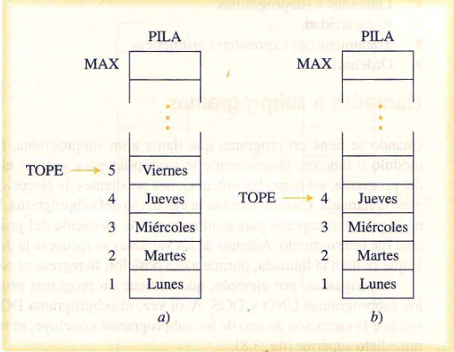
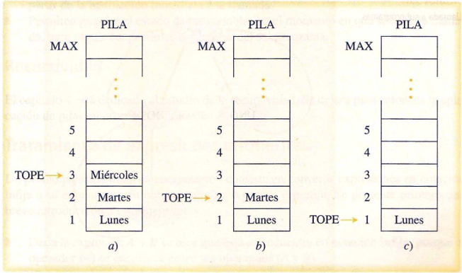

# Algoritmo 3.1
## Pila_vacia (PILA, TOPE, BAND)

### Descripción
Este algoritmo verifica si una estructura tipo pila `PILA` está vacía, asignando a `BAND`
el valor de verdad correspondiente. La pila se implementa en un arreglo unidimensional. `TOPE` 
es un parámetro de tipo entero. `BAND` es un parámetro de tipo booleano.

### Algoritmo
1. Si (`TOPE=0`) {Verifica si no hay elementos almacenados en la pila} 
     - *entonces*
         - Hacer `BAND <- VERDADERO` {La pila está vacía}
     - *si no*
         - Hacer `BAND <- FALSO` {La pila no está vacía}
  2. {Fin del condicional del paso 1}

### Código

# Algoritmo 3.2
## Pila_llena (PILA, TOPE, MAX, BAND)
### Descripción
 Este algoritmo verifica si una estructura tipo pila `PILA` está llena, asignando a `BAND` el 
 valor de verdad correspondiente. La pila se implementa en un arreglo unidimensional de `MAX`
 elementos. `TOPE` es un parámetro de tipo entero. `BAND` es un parámetro de tipo boooleano.
 ### Algoritmo
  1. Si (`TOPE=MAX`) 
     - *entonces*
         - Hacer `BAND <- VERDADDERO` {La pila está llena}
     - *si no*
         - Hacer `BAND <- FALSO` {La pila no está llena}
  2. {Fin del condicional del paso 1}
### Código

# Algoritmo 3.3
## Pone (PILA, TOPE, MAX, DATO)
### Descripción
Este algoritmo agrega el elemento `DATO` en una estructura tipo pila `PILA`, si la misma
 no está llena. Actualiza el valor de `TOPE`. `MAX` representa el número máximo de elementos
 que puede almacenar `PILA`. `TOPE` es un parámetro de tipo entero.
 ### Algoritmo
  1. Llamar a `Pila_llena` con `PILA`, `TOPE`, `MAX` y `BAND`
  2. Si (`BAND=VERDADERO`)
      - *entonces*
          - Escribir "Desbordamiento-Pila llena"
      - *si no*
          - Hacer `TOPE <- TOPE + 1` y `PILA[TOPE] <- DATO`
          {Actualiza TOPE e inserta el nuevo elemento en el TOPE de PILA}
  3. {Fin de condicional del paso 2}
### Código

# Algoritmo 3.4
## Quita (PILA, TOPE, DATO)
### Descripción
Este algoritmo saca un elemento `DATO` de unaestructura tipo pila `PILA`, si ésta n
 se encuentra vacía. El elemento que se elimina es el que se encuentra en la posición indicada
 por `TOPE`.
 ### Algoritmo
  1. Llamar a `Pila_vacia` con `PILA`, `TOPE` y `BAND`
  2. Si (`BAND=VERDADERO`)
      - *entonces*
          - Escribir "Subdesbordamiento-Pila vacía"
      - *si no*
          - Hacer `DATO <- PILA[TOPE]` y `TOPE <- TOPE - 1` {Actualiza TOPE}
  3. {Fin de condicional del paso 2}
### Código

# Ejemplo 3.1
Si se insertaran los elementos *lunes, martes, miércoles, jueves y viernes* en `PILA`, la
 estructura quedaría tal y como se muestra en la figura 3.6a. Ahora bien, si se elimina
 el elemento *viernes*, el `TOPE` apuntaría ahora a jueves (fig. 3.6b). 
 
 
 
 Si en algún momento se quisiera eliminar al elemento *martes*, esto no sería posible
 ya que sólo se puede tener acceso al elemento que se encuentra en la cima de la pila. 
 
  Una forma de resolver este problema es eliminar primeramente los elementos jueves y
 miércoles, de esta manera martes quedaría ubicado en la cima de `PILA` y ahora sería
 posible extraerlo (figuras 3.7a, 3.7b y 3.7c).

# Ejemplo 3.2

En este ejemplo se exponen dos casos de traducción de notación infija a posfija. El primero de ellos es una expresión simple, mientras que el segundo presenta mayor grado de complejidad. En la tabla 3.1 se muestran los pasos necesarios para lograr la traducción de la primera expresión, y en la tabla 3.2 los correspondientes a la segunda expresión.

- A) Expresión infija: `X + Z * W`  
       Expresión postfija: `XZW*+`  

##### Tabla 3.1: Traducción de infinita a postfija

| Pasos | Expresión      |
|-------|----------------|
| 0     | X + Z * W      |
| 1     | X + Z W *    |
| 2     | X Z W * +    |

El primer operador que se procesa durante la traducción de la expresión es la multiplicación, paso 1, debido a que es el de más alta prioridad. Se coloca el operador de tal manera que los operandos afectados por él lo precedan. Para el operador de suma se sigue el mismo criterio, los dos operandos lo preceden. En este caso, el primer operando es X y el segundo es `ZW*`.

- B) Expresión infija: `(X +Z)* W / T ^ Y - V` \
       Expresión postfija: `XZ+W*TY^/V-`

##### Tabla 3.2: Traducción de infinita a postfija

| Pasos | Expresión              |
|-------|------------------------|
| 0     | (X + Z) * W / T ^ Y - V |
| 1     | XZ + * W / T ^ Y - V   |
| 2     | XZ + * W / T Y ^ - V   |
| 3     | XZ + W * / T Y ^ - V   |
| 4     | XZ + W * T Y ^ / - V   |
| 5     | XZ + W * T Y ^ / V -     |

En el paso 1 se convierte la subexpresión que se encuentra entre paréntesis por ser
 la de más alta prioridad. Luego se sigue con el operador de potencia, paso 2, y así con
 los demás, según su jerarquía. Como consecuencia de que la multiplicación y la división tienen igual prioridad, se procesa primero la multiplicación por encontrarse más a
 la izquierda en la expresión, paso 3. El operador de la resta es el último que se mueve,
 paso 5. A continuación se presenta el algoritmo que traduce una expresión infija a otra
 posfija.
 
# Algoritmo 3.5

## Conv_postfija (EL, EPOS)
### Descripción
Este algoritmo traduce una expresión infija `EI` a postfija `EPOS`, haciendo uso de 
una pila `PILA`. `MAX` es el número máximo de elementos que puede almacenar la pila.

### Algoritmo
1. Hacer `TOPE <- 0`
2. Mientras (`EL` sea diferente de la cadena vacía) Repetir
   - Tomar el símbolo más a la izquierda de `EL`. Recortar luego la expresión.
   - 2.1 Si (el símbolo es paréntesis izquierdo):
       - *entonces* {Poner símbolo en `PILA`. Se asume que hay espacio en `PILA`}
         - Llamar a `Pone` con `PILA`, `TOPE`, `MAX` y símbolo
       - *sino*
      - 2.1.1 Si (el símbolo es paréntesis derecho):
           - *entonces*
              - 2.1.1.1 Mientras (`PILA[TOPE] != paréntesis izquierdo`) Repetir
                - Llamar a `Quita` con `PILA`, `TOPE` y `DATO`
                - Hacer `EPOS <- EPOS + DATO`
             - 2.1.1.2 {Fin del ciclo del paso 2.1.1.1}
               - Llamar a `Quita` con `PILA`, `TOPE` y `DATO`
                {Se quita el paréntesis izquierdo de `PILA` y no se agrega a `EPOS`}
                - *si no*
             - 2.1.1.3 Si (el símbolo es un operador):
               - *entonces*
                 - Agregar símbolo a `EPOS`
               - *si no* {Es un operador}
               - Llamar `Pila_vacia` con `PILA`, `TOPE` y `BAND`
                - 2.1.1.3A Mientras (`BAND = FALSO`) y (la prioridad del operador sea <= que la prioridad del operador que está encima de `PILA`) Repetir
                   - Llamar a `Quita` con `PILA`, `TOPE`, `DATO`
                   - Hacer `EPOS <- EPOS + DATO`
                   - Llamar a `Pila_vacia` con `PILA`, `TOPE` y `BAND`
               - 2.1.1.3B {Fin del ciclo del paso 2.1.1.3A}
                   - Llamar a `Pone` con `PILA`, `TOPE` y simbolo
              - 2.1.1.4 {Fin del condicional del paso 2.1.1.3}:
      - 2.1.2 {Fin del condicional del paso 2.1.1}
    - 2.2 {Fin del condicional del paso 2.1}
3. {Fin del ciclo del paso 2}
4. Llamar `Pila_vacia` con `PILA`, `TOPE` y `BAND`
5. Mientras (`BAND = FALSO`) Repetir:
   - Llamar a `Quita` con `PILA`, `TOPE` y `DATO`
   - Hacer `EPOS <- EPOS + DATO`
   - Llamar a `Pila_vacia` con `PILA`, `TOPE` y `BAND`
6. {Fin del ciclo del paso 5}
7. Escribe `EPOS`

### Código

# Ejemplo 3.3
Eneste ejemplo se retoman los casos del ejemplo 3.2 para ilustrar el funcionamiento del
 algoritmo Conv_posfija.

- A) Expresión infija: `X + Z * W`  
       Expresión postfija: `XZW*+`

 En la tabla 3.3 se presentan los pasos necesarios para lograr la traducción deseada
 siguiendo el algoritmo 3.5. 
 
 ##### Tabla 3.3: Traducción de infinita a postfija

| Pasos | El      | Símbolo analizado  | Pila | EPOS |
|-------|---------|--------------------|------|------|
| 0     |  X+Z*W  |                    |      |       |
| 1     |  +Z*W   | X                  |      |  X    |
| 2     |  Z*W    | +                  | +    | X     |
| 3     |  *W     |   Z                | +    | XZ    |
| 4     |  W      |  *                 | +*   | XZ    |
| 5     |         |   W                | +*   | XZW   |
| 6     |         |                    | +    | XZW*  |
| 7     |         |                    |      |  XZW*+|
 
 En los pasos 1, 3 y 5 el símbolo analizado -un operando- se agrega directamente
 a `EPOS`. Al analizar el operador +, paso 2, se verifica si en PILA hay operadores con
 mayor o igual prioridad. En este caso, `PILA` está vacía; por tanto, se pone el símbolo
 en el tope de ella. Con el operador *, paso 4, sucede algo similar. En `PILA` no existen operadores de mayor o igual prioridad - la suma tiene menor prioridad que la multiplicación -, por lo que se agrega el operador * a `PILA`. En los dos últimos pasos, 6 y 7, se
 extraen de `PILA` sus elementos, agregándolos a `EPOS`.

- B) Expresión infija: `(X +Z)* W / T ^ Y - V` \
       Expresión postfija: `XZ+W*TY^/V-`

En la tabla 3.4 se presentan los pasos necesarios para lograr la traducción deseada,
 siguiendo el algoritmo 3.5.
  ##### Tabla 3.4: Traducción de infinita a postfija

| Pasos | El              | Símbolo analizado  | Pila | EPOS |
|-------|-----------------|--------------------|------|------|
| 0     |  (X+Z)*W/T^Y-V  |           |           |                |
| 1     |  X+Z)*W/T^Y-V   |     (     |     (     |                |
| 2     |  +Z)*W/T^Y-V    |     X     |     (     |     X          |
| 3     |  Z)*W/T^Y-V     |     +     |     (+    |     X          |
| 4     |  )*W/T^Y-V      |     Z     |     (+    |     XZ         |
| 5     |  *W/T^Y-V       |     )     |     (     |     XZ+        |
|       |                 |     )     |           |     XZ+        |     
| 6     |  W/T^Y-V        |     *     |     *     |     XZ+        |    
| 7     |  /T^Y-V         |     W     |     *     |     XZ+W       |   
| 8     |  T^Y-V          |     /     |     /     |     XZ+W*      |   
|       |                 |     /     |     /     |     XZ+W*      |       
|  9    |  ^Y-V           |     T     |     /     |     XZ+W*T     |    
| 10    |  Y-V            |     ^     |     /^    |     XZ+W*T     |   
| 11    |  -V             |     Y     |     /^    |     XZ+W*TY    |     
|       |                 |     -     |     /     |     XZ+W*TY^   |
| 12    |  V              |     -     |           |     XZ+W*TY^/  |     
|       |                 |     -     |     -     |     XZ+W*TY^/  |
| 13    |                 |     V     |     -     |     XZ+W*TY^/V |
| 14    |                 |           |           |     XZ+W*TY^/V-|

 Los pasos que se consideran más relevantes son: en el paso 5, al analizar el paréntesis derecho se extraen repetidamente todos los elementos de `PILA` (en este caso
 sólo el operador +), agregándolos a `EPOS` hasta encontrar un paréntesis izquierdo. El
 paréntesis izquierdo se quita de `PILA` pero no se incluye en `EPOS`.
 
 Cuando se trata el operador de división, paso 8, se quita de `PILA` el operador * y se
 agrega a `EPOS`, ya que la multiplicación tiene igual prioridad que la división. Al analizar el operador de resta, paso 12, se extraen de `PILA` y se incorporan a `EPOS` todos los
 operadores de mayor o igual prioridad, en este caso son todos los que están en ella -la
 potencia y la división-, agregando finalmente el símbolo en `PILA`. Luego de agregar a
 `EPOS` el último operando, y habiendo revisado toda la expresión inicial, se vacía `PILA`
 y se incorporan los operadores (en este caso el operador-) a la expresión postfija.

# Ejemplo 3.4

 En este ejemplo se exponen dos casos de traducción de notación infija a prefija. El primero de ellos es una expresión simple, mientras que el segundo presenta mayor grado
 de complejidad.

- A) Expresión infija: `X + Z * W`  
       Expresión prefija: `XZW*+`
  
En la tabla 3.5 se presentan los pasos necesarios para lograr la traducción deseada.

##### Tabla 3.5: Traducción de infinita a prefija

| Pasos | Expresión      |
|-------|----------------|
| 0     | X + Z * W      |
| 1     | X + * Z W     |
| 2     | + X * Z W    |

 Como en el caso de la notación postfija, ejemplo 3.2, aquí también el operador
 multiplicación se procesa primero. De la traducción de la expresión, paso 1, resulta el
operador precediendo a los operandos. Lo mismo para el operador de suma, paso 2.

- B) Expresión infija: `(X +Z)* W / T ^ Y - V` \
       Expresión prefija: `-/*+XZW^TYV`

 En la tabla 3.6 se presentan los pasos necesarios para lograr la traducción deseada.

 ##### Tabla 3.6: Traducción de infinita a prefija

| Pasos | Expresión      |
|-------|----------------|
| 0     |   (X+Z)*W/T^-V   |
| 1     | +XZ*W/T^Y-V   |
| 2     | +XZ*W/^TY-V   |
| 3     |     *+XZW/^TY-V |
|  4    |     /*+XZW^TY-V |
| 5     |     -/*+XZW^TYV |

 Lo primero que se procesa en este caso es la subexpresión que se encuentra entre
 paréntesis, paso 1. El orden en que se procesan los operadores es el mismo que se siguie para la conversión de infija a posfija. Por tanto, sería reiterativo volver a explicar paso a
 paso el contenido de la tabla 3.6. Sin embargo, es de destacar la posición que ocupan los
 operadores con respecto a los operandos: los primeros preceden a los segundos.
 
 A continuación se incluye el algoritmo de conversión de notación infija a prefija.
 Este algoritmo se diferencia del anterior básicamente en el hecho de que los elementos
 de la expresión en notación infija se recorrerán de derecha a izquierda.
 
# Algoritmo 3.6
## Conv_pretfija (EL, EPRE)
### Descripción
 Este algoritmo traduce una expresión en notación infija, `El` a prefija, `EPRE`, haciendo uso de una pila `PILA`.`TOPE` es una variable de tipo entero y `MAX` representa el máximo número de elementos que puede almacenar la pila.

### Algoritmo
1. Hacer `TOPE <- 0`
2. Mientras (`EL` sea diferente de la cadena vacía) Repetir
   - Tomar el símbolo más a la derecha de `EL` recortartando luego la expresión
   - 2.1 Si (el símbolo es paréntesis derecho)
       - *entonces* {Poner símbolo en pila} 
         - Llamar a `Pone` con `PILA`, `TOPE`, `MAX` y símbolo
       - *si no*
      - 2.1.1 Si (el símbolo es paréntesis izquierdo):
           - *entonces*
              - 2.1.1.1 Mientras (`PILA[TOPE] != paréntesis derecho`) Repetir
                - Llamar a `Quita` con `PILA`, `TOPE` y `DATO`
                - Hacer `EPRE <- EPORE + DATO`
             - 2.1.1.2 {Fin del ciclo del paso 2.1.1.1}  {Sacamos el paréntesis derecho de PILA y no se agrega a EPRE}
               - Llamar a `Quita` con `PILA`, `TOPE` y `DATO`
              - *si no*
             - 2.1.1.3 Si (el símbolo es un operador):
               - *entonces*
                 - Agregar símbolo a `EPRE`
               # FALTA PAGINA 90 Y 91
### Código

# Algoritmo 3.7
## Inserta_cola (COLA, MAX, FRENTE, FINAL, DATO)
### Descripción
Este algoritmo inserta el elemento `DATO` al final de una estructura tipo cola. `FRENTE` y `FINAL` son los punteros que indican, respectivamente, el inicio y fin de `COLA`. La primera vez `FRENTE` y `FINAL` tienen el valor O, ya que la cola está vacía. `MAX` es el máximo número de elementos que puede almacenar la cola.
 
 ### Algoritmo
  1. Si (`FINAL<MAX`) {Verifica que hay espacio libre}
     - *entonces*
       - Hacer `FINAL <- FINAL + 1` {Actualiza `FINAL`} y `COLA[FINAL] <- DATO`
      - 1.1 Si (`FINAL = 1`) *entonces* {Se insertó el primer elemento de `COLA`}
          - Hacer `FRENTE <- 1`
      - 1.2 {Fin del condicional del paso 1.1}
          - *si no*
            - Escribir "Desbordamiento-Cola llena"
  2. {Fin de condicional del paso 1}
### Código

# Algoritmo 3.8
## Elimina_cola (COLA, FRENTE, FINAL, DATO)
### Descripción
Este algoritmo eliminael primerelemento de una estructura tipo cola y lo almacenaen `DATO`.
 `FRENTE` y `FINAL` son los punteros que indican, respectivamente, el inicio y fin de la cola
 
 ### Algoritmo
  1. Si (`FRENTE != 0`) {Verifica que la cola no este vacía}
     - *entonces*
       - Hacer `DATO <- COLA [FRENTE]` 
        - 1.1 Si (`FRENTE = FINAL`)  {Si hay un solo elemento}
          - *entonces*
            - Hacer `FRENTE <- 0` y `FINAL <- 0` {Indica `COLA` vacía}
          - *si no*
            - Hacer  `FRENTE <- FRENTE + 1`
        - 1.2 {Fin del condicional del paso 1.1}
          - *si no*
            - Escribir "Subdesbordamiento-Cola vacía"
  2. {Fin de condicional del paso 1}
### Código

# Algoritmo 3.9
## Cola_vacia (COLA, FRENTE, BAND)
### Descripción
Este algoritmo determina si una estructura de datos tipo cola está vacía, asignando a `BAND`
 el valor de verdad correspondiente.
 
 ### Algoritmo
  1. Si (`FRENTE = 0`) 
     - *entonces*
       - Hacer `BAND <- VERDADERO` 
     - *si no*
       - Hacer `BAND <- FALSO`
  2. {Fin de condicional del paso 1}
### Código

# Algoritmo 3.10
## Cola_llena (COLA, FINAL, MAX, BAND)
### Descripción
Este algoritmo determina si una estructura de datos tipo cola está llena, asignando a `BAND`
 el valor de verdad correspondiente. `MAX` es el número máximo de elementos que puede
 almacenar `COLA`.
 
 ### Algoritmo
  1. Si (`FINAL = MAX`) 
     - *entonces*
       - Hacer `BAND <- VERDADERO` 
     - *si no*
       - Hacer `BAND <- FALSO`
  2. {Fin de condicional del paso 1}
     
### Código

# Ejemplo 3.6
 Retome el ejemplo 3.1 de la sección 3.1.2. Se insertan en `COLA` los elementos: *lunes,
 martes, miércoles, jueves y viernes* -en ese orden-, de modo que la estructura queda
 como se muestra en la figura 3.14. Para este ejemplo `MAX =7`

 El elemento *lunes* es el primero que se puede eliminar por el el primero que se insertó en la cola. Luego de la eliminación, `FRENTE` guarda la posición del suiguiente elemento (fig 3.15a). Si ahora se insertara *sábado*, éste ocuparía ahora la posición siguiente al elemento *viernes* (fig. 3.15b). 

 Analice lo que ocurre en la cola, si se llevan a cabo las siguientes operaciones:
- Se eliminan *martes, miércoles, jueves* y *viernes* (fig. 3.16a).
- Se inserta *domingo* (fig. 3.16b).
- Se elimina *sábado* (fig. 3.16c).

Después de insertar al elemento *domingo*, ya no se puede insertar nuevos elementos a la cola porque `FINAL` es igual que `MAX (FINAL=MAX=7)`. Sin embargo, como lo refleja la figura 3.16c, existe espacio disponible desperdiciado.

Observe que luego de insertar *domingo* se llegó a una situacion conflictiva porque a pesar de que hay espacio disponible, no se puede insertar otros elementos. Este inconveniente se puede superar perfectamente si manejamos las colas en forma circular.

 
# Algoritmo 3.11
## Inserta_circular (COLACIR, MAX, FRENTE, FINAL, DATO)
### Descripción
Este algoritmo inserta el elemento `DATO` al final de una estructura tipo cola circular `COLACIR`. `FRENTE` y `FINAL` son los punteros que indican, respectivamente, el inicio y el fin de la cola circular. `MAX` es el número máximo de elementos que puede almacenar `COLACIR`
 ### Algoritmo
  1. Si ((`FINAL = MAX`) y (`FRENTE = 1`)) o ((`FINAL + 1) = FRENTE`)
     - *entonces*
         - Escribir "Desbordamiento-Cola llena"
     - *si no* 
        - 1.1 Si (`FINAL = MAX`)  
          - *entonces*
            - Hacer `FINAL <- 1` 
          - *si no*
            - Hacer  `FINAL <- FINAL + 1`
        - 1.2 {Fin del condicional del paso 1.1}
          - Hacer `COLACIR[FINAL] <- DATO`
        - 1.3 Si (`FRENTE = 0`) *entonces*
          - Hacer `FRENTE <- 1`
        - 1.4 {Fin del condicional del paso 1.3}
  2. {Fin de condicional del paso 1}
     
### Código

# Algoritmo 3.12
## Elimina_circular (COLACIR, MAX, FRENTE, FINAL, DATO)
### Descripción
Este algoritmo elimina el primer elemento de una estructura tipo cola circular `COLACIR`y lo alamacena en `DATO` 
`FRENTE` y `FINAL` son los punteros que indican, respectivamente, el inicio y el fin de la estructura.
`MAX` es el tamaño de `COLACIR`
 ### Algoritmo
  1. Si (`FRENTE = 0`) {Verifica si la cola está vacía}
     - *entonces*
         - Escribir "Subdesbordamiento-Cola vacía"
     - *si no*
         - Hacer `DATO <- COLACIR [FRENTE]`
        - 1.1 Si (`FRENTE = FINAL`) {Si hay sólo un elemento}
          - *entonces*
            - Hacer `FRENTE <- 0` y  `FINAL <- 0`
          - *si no*
          - 1.1.1 Si (`FRENTE = MAX`)
            - *entonces*
              - Hacer `FRENTE <- 1`
            - *si no*
              - Hacer `FRENTE <- FRENTE + 1`
          - 1.1.2 {Fin del condicional 1.1.1}
        - 1.4 {Fin del condicional del paso 1.1}
  2. {Fin de condicional del paso 1}
### Código

# Ejemplo 3.7
En la figura 3.18a se presenta una estructura tipo cola circular de máximo 8 elementos `(MAX=8)`, en la cual ya se han almacenado algunos valores. En la figura 3.18b se muestra el estado de la cola luego de insertar el elemnto `NN`. 

Si se quisiera insertar otro elemento se presentaria un error de desbordamiento, ya que `FINAL+1 = FRENTE`. 

A continuacion se eliminan los valores `XX,YY,ZZ,KK, y VV` en ese orden. La cola queda como se muestra en la figura 3.19.

Ahora se elimina el siguiente elemento `RR`. Al ser `FRENTE = MAX`, se le da el valor de 1, figura 3.20.

Al eliminar `NN`, como `FRENTE = FINAL`, es decir, sólo quedaba un elemnto en la cola, actualizamos los dos punteros en cero. La cola queda vacia, figura 3.21.
